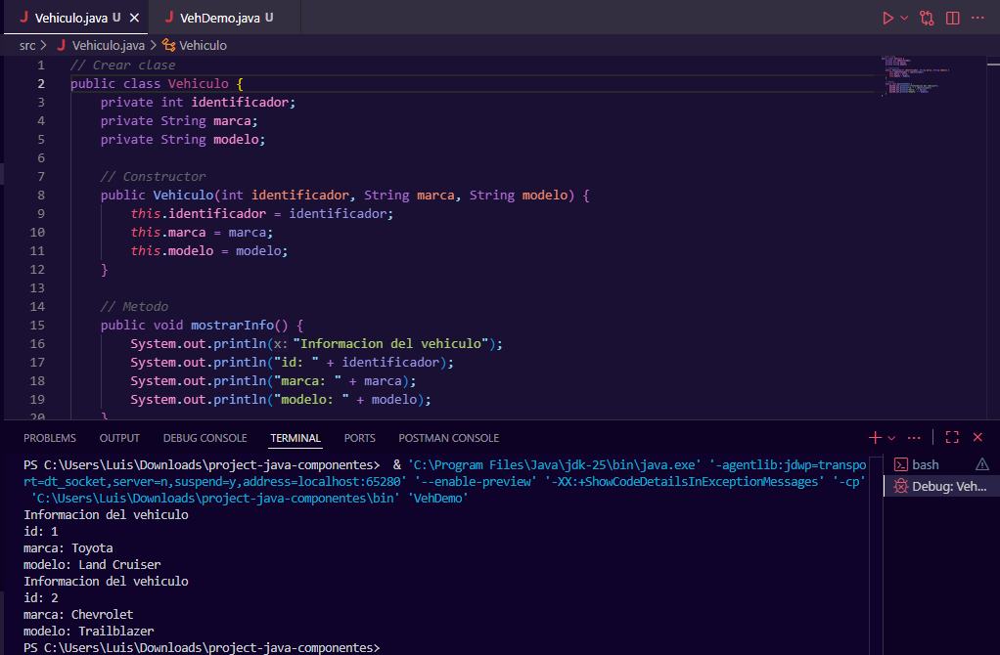
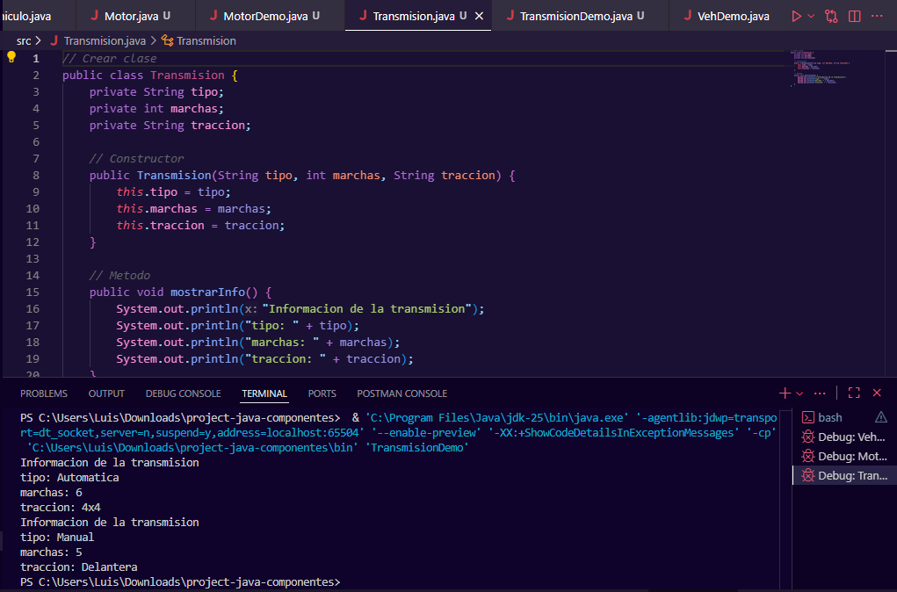
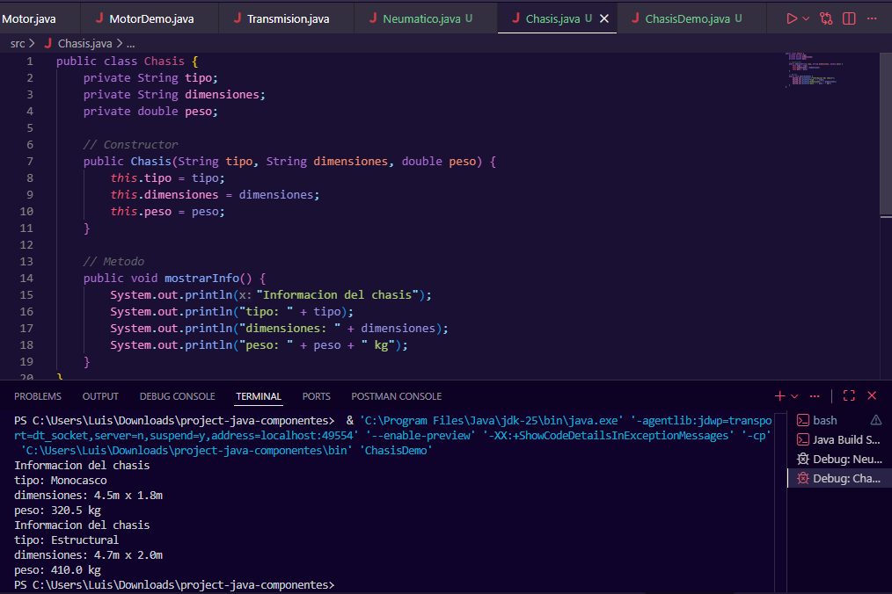
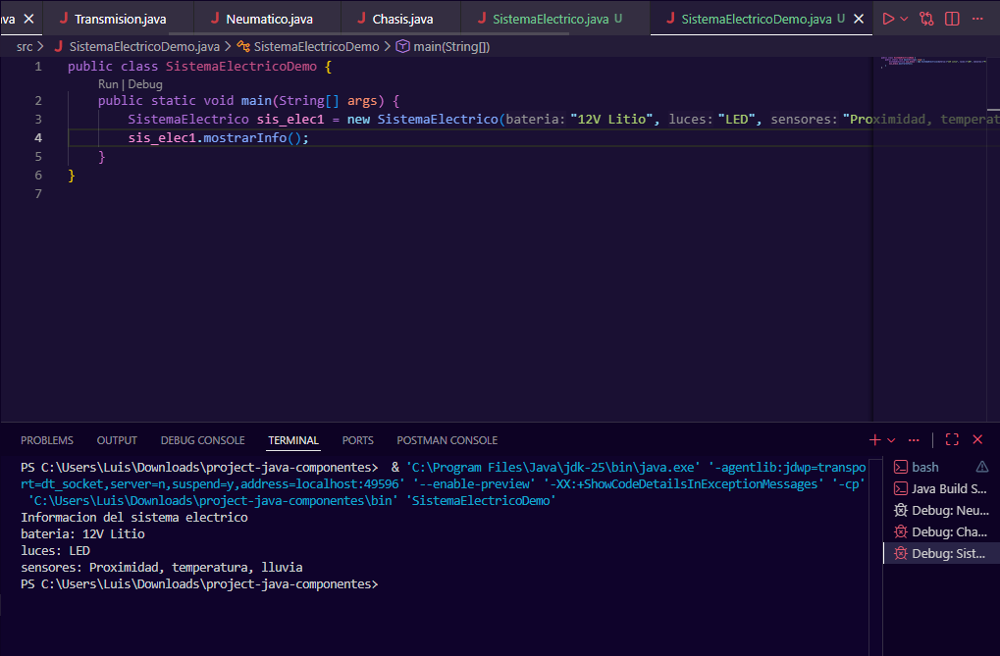
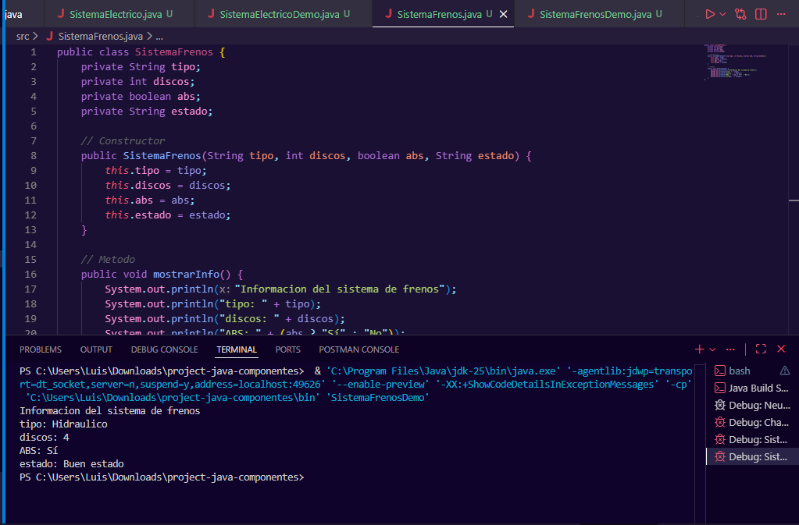
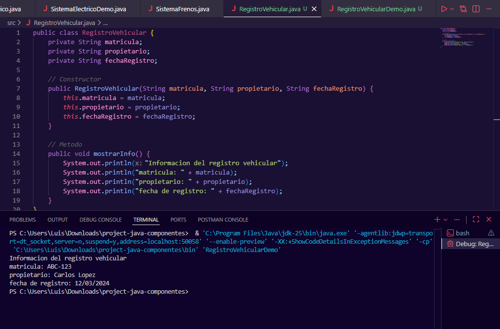
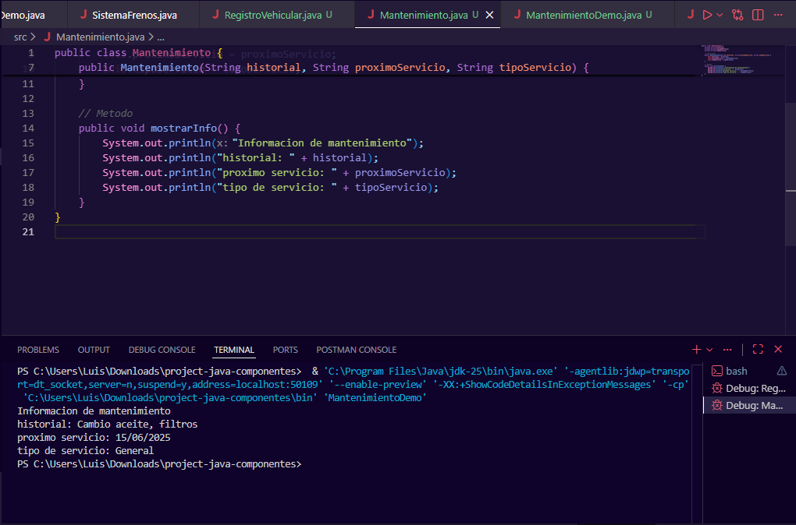
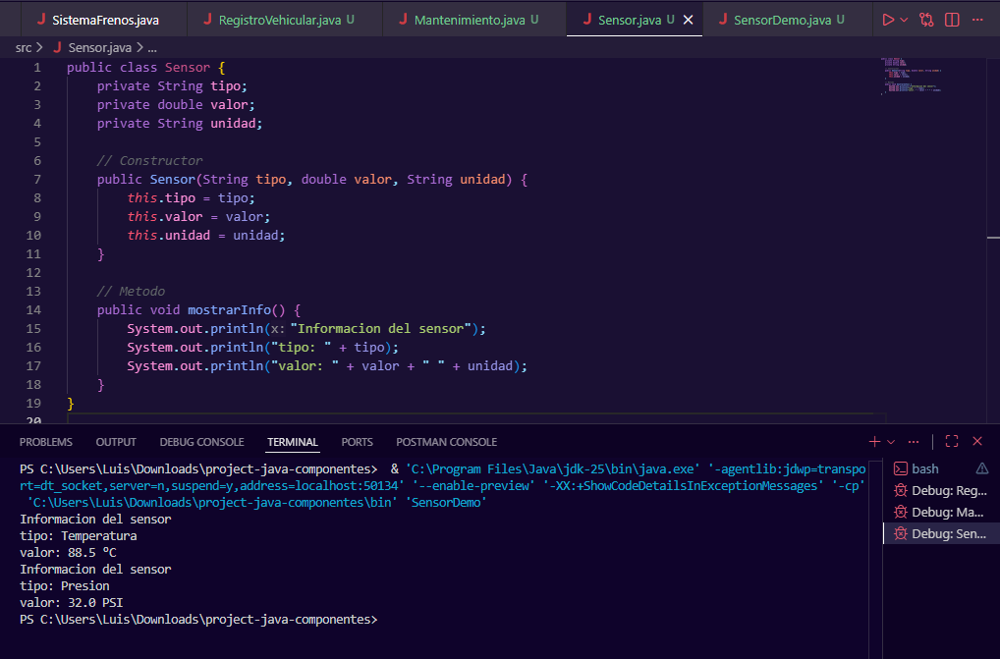

# Project java componentes

Este proyecto implementa varias clases que representan los sistemas y componentes principales de un vehículo.  
Cada clase incluye atributos, constructor y un método para mostrar su información.  
Además, todas las clases fueron probadas mediante archivos *Demo* que crean objetos y muestran la salida por consola.

---

## Descripción de las Clases y sus Relaciones

A continuación se describen todas las clases creadas y cómo se relacionan entre sí.

### Vehiculo
Representa un vehículo genérico con identificación, marca y modelo.  
Se relaciona con varias clases porque las utiliza como parte de su composición interna.

### Motor
Describe las características técnicas del motor: tipo, cilindrada y potencia.  
Es utilizado por la clase Vehiculo.

### Transmision
Contiene la descripción del sistema de transmisión: tipo, marchas y tracción.  
Es parte de la composición de Vehiculo.

### Chasis
Incluye tipo de chasis, dimensiones y peso.  
Vehiculo contiene un objeto de esta clase.

### Neumatico
Representa una llanta con datos como marca, tamaño y presión.  
Un vehículo puede tener varios neumáticos.

### SistemaElectrico
Describe el sistema eléctrico del vehículo: batería, luces y sensores eléctricos.  
Es otro componente interno de Vehiculo.

### SistemaFrenos
Contiene información del sistema de frenos: tipo, discos, ABS y estado.  
Vehiculo también incluye un objeto de esta clase.

### RegistroVehicular
Datos legales del vehículo: matrícula, propietario y fecha de registro.

### Mantenimiento
Registra mantenimientos realizados o programados.  
Un vehículo puede tener varios registros de mantenimiento.

### Sensor
Modela sensores como temperatura, presión o velocidad.  
Vehiculo puede contener una lista de sensores.

---

## Relaciones Generales del Sistema

El vehículo actúa como clase principal y todos los demás componentes se integran en él mediante composición o agregación.

---

## Capturas de Pantalla de la Ejecución

Las siguientes imágenes corresponden a la creación de objetos y uso de métodos en las clases Demo.  
Cada captura muestra la salida por consola de su respectiva clase.

### Vehiculo

### Motor

### Transmision

### Chasis

### Neumatico

### SistemaElectrico

### SistemaFrenos

### RegistroVehicular

### Mantenimiento

### Sensor

---

